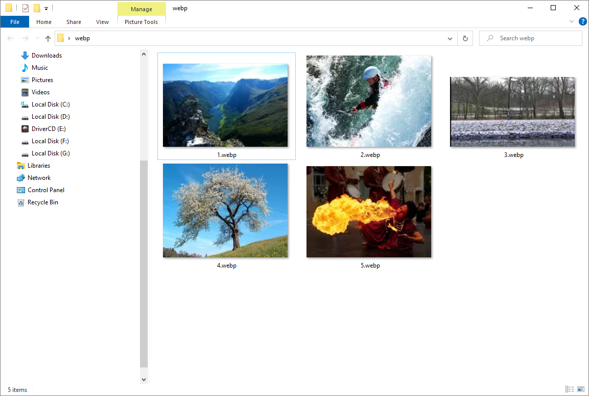

# Webp Preview For Windows Explorer

The shell extension teaches Windows Explorer to display previews of [webp](https://developers.google.com/speed/webp/gallery1).



## Compatibility

The extension was developed and tested on `Windows 10` though I expect it to work on other windows versions.

## Installation

You can install the extension either manually or using the installer.

### Installer

1. Download the `Installer` from the [Releases][releases] section
2. Run the `Installer`

### Manual installation

1. Download the `DLL` from the [Releases][releases] section
2. Put the `DLL` into the desired place in your system
3. Register the `DLL` via `regsvr32`.
   ```
   C:\Windows\SysWOW64\regsvr32.exe C:\Where\The\Dll\Resides\webpext64.dll
   ```

   To unregister the `DLL` later again use `regsvr32`:
   ```
   C:\Windows\SysWOW64\regsvr32.exe /u C:\Where\The\Dll\Resides\webpext64.dll
   ```
   Normally no admin permissions should be required for the registration.

[releases]: https://github.com/winseros/WebpPreviewForWindowsExplorer/releases
